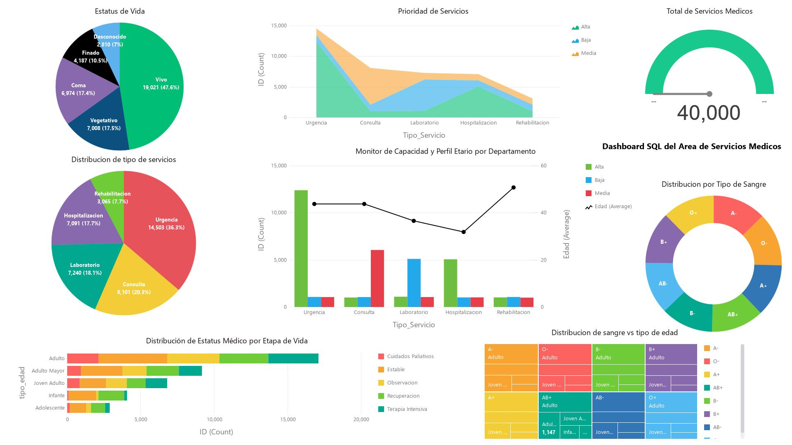
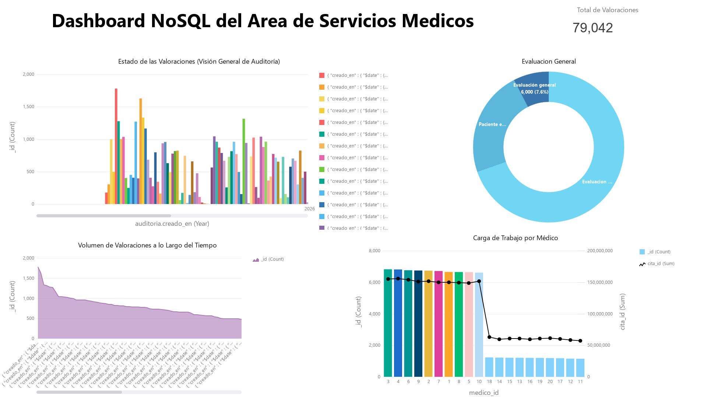

# API_ServiciosMedicos_SQL_NoSQL


## Descripción

API REST diseñada para ejecutar **pruebas de población de datos** en el área de servicios médicos, utilizando una arquitectura **híbrida SQL + NoSQL**.

El sistema permite:

* Generar grandes volúmenes de datos clínicos
* Integrar MySQL y MongoDB en un mismo flujo
*  Analizar rendimiento entre ambos modelos de base de datos
*  Simular escenarios reales del sector médico

## Guía de Documentación del Proyecto

La documentación del proyecto se encuentra distribuida en distintos módulos para facilitar la instalación, configuración y ejecución del sistema.

### 1. Levantar la API

Para configurar las variables de entorno, instalar dependencias y ejecutar el servidor, consultar:

```text
API/README.md
```

En este documento se describe:

- Requisitos previos
- Instalación de dependencias
- Configuración del archivo `.env`
- Conexión con MySQL y MongoDB
- Ejecución en modo desarrollo y producción
- Uso de Swagger
- Solución de errores frecuentes

### 2. Configuración de la Base de Datos SQL

Para crear la base de datos relacional, importar estructuras y restaurar respaldos, consultar:

```text
database/SQL/README.md
```

En este documento se encuentra:

- Creación de la base de datos MySQL
- Scripts de estructura
- Procedimientos almacenados
- Restauración de respaldos
- Verificación de tablas y relaciones

Archivos relacionados:

```text
database/SQL/
├── structure/
├── routines/
└── backups/
```

### 3. Configuración de la Base de Datos NoSQL

Para crear la base de datos documental y la colección de valoraciones en MongoDB, consultar:

```text
database/NoSQL/README.md
```

Este documento incluye:

- Uso de mongosh
- Creación de la base de datos
- Creación de la colección `valoraciones`
- Schema de validación
- Inserción de documentos de prueba
- Consultas básicas
- Restauración de respaldos JSON

Archivos relacionados:

```text
database/NoSQL/
└── backups/
```

### 4. Documentación de Endpoints

Una vez iniciada la API, la documentación interactiva de los servicios REST estará disponible mediante Swagger:

```text
http://localhost:3000/api-docs
```

Desde esta interfaz es posible:

- Consultar endpoints
- Revisar parámetros
- Visualizar respuestas
- Ejecutar pruebas directamente desde el navegador

### Flujo Recomendado de Instalación

```text
1. Consultar database/SQL/README.md
   └─ Crear base de datos MySQL

2. Consultar database/NoSQL/README.md
   └─ Crear base de datos MongoDB y colección valoraciones

3. Consultar API/README.md
   └─ Configurar variables de entorno
   └─ Instalar dependencias
   └─ Ejecutar la API

4. Abrir Swagger
   └─ http://localhost:3000/api-docs
```

Siguiendo esta secuencia es posible desplegar completamente el sistema híbrido SQL + NoSQL y comenzar a realizar pruebas de generación de datos.

## Posibles Test a Arealizar
| Test | Descripción |
|---|---|
| Test 1 | Generación automática de 10,000 registros clínicos en entorno hospitalario |
| Test 2 | Generación de 15,000 pacientes alérgicos con edades entre 10 y 70 años |
| Test 3 | Generación de 5,000 pacientes pediátricos con antecedentes alérgicos |
| Test 4 | Generación de 4,000 pacientes asignados al servicio de Laboratorio con prioridad Baja |
| Test 5 | Generación de 4,000 pacientes adultos mayores en Hospitalización clasificados como casos graves |

## Autores

1. **Jose Francisco Flores Amador** / [@JFFA25](https://github.com/JFFA25)
2. **Edgar Cabrera Velázquez** / [@Edgar-Cbr](https://github.com/Edgar-Cbr)
3. **Edwin Hernández Campos** / [@Edwinhdzcm](https://github.com/Edwinhdzcm)
4. **Giovany Raul Pazos Cruz** / [@giova0412](https://github.com/giova0412)
5. **Uriel Maldonado Bernabe** / [@Urii7895](https://github.com/Urii7895)

## Tecnologías utilizadas

| Componente          | Tecnología                                                                                                                                                                                                                                         |
| ------------------- | -------------------------------------------------------------------------------------------------------------------------------------------------------------------------------------------------------------------------------------------------- |
| Backend             | Node.js + Express   |
| Base de datos SQL   | MySQL                                                                                                                                      |
| Base de datos NoSQL | MongoDB + Mongoose                                  |
| Documentación       | Swagger                                                                                                                              |
| Configuración       | Dotenv                                                                                                                                  |
| Middleware          | CORS                                                                                                                                                               |

## Estructura del proyecto

```bash id="main1"
API/
│── controllers/
│── routes/
│── models/
│── dashboard/
│── database/
│   ├── SQL/
│   │   ├── backups/
│   │   ├── routines/
│   │   └── structure/
│   └── NoSQL/
│       └── backups/
```
## Endpoints principales

| Método | Endpoint            | Descripción                          |
| ------ | ------------------- | ------------------------------------ |
| POST   | `/api/poblar-test`  | Generación híbrida (MySQL + MongoDB) |
| POST   | `/api/poblar-nosql` | Generación exclusiva en MongoDB      |

## Dashboards (Resultados)

### Dashboard SQL (Actualizado)



### Dashboard NoSQL (Actualizado)



## Flujo del sistema

```text id="main2"
Cliente → Routes → Controllers → (MySQL + MongoDB) → Respuesta → Dashboard
```
## Objetivo del proyecto

* Comparar bases de datos SQL vs NoSQL
* Evaluar rendimiento en generación de datos
* Simular escenarios clínicos reales
* Analizar escalabilidad del sistema

## Notas

* Arquitectura basada en **Node.js + Express**
* Uso de **Mongoose** para modelado NoSQL
* Integración con **MySQL mediante procedimientos almacenados**
* Dashboards para análisis visual de resultados
